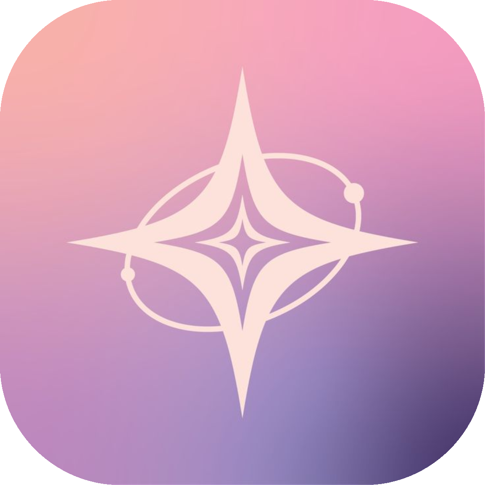
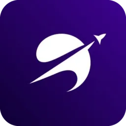

<h1 align="center">Heya, I'm Daniel! </h1>

<h3 align="center">👨‍💻 Full-Stack Developer | Systems & ML Enthusiast</h3>

I build across the stack — from native desktop apps and cross-platform mobile clients to custom machine learning systems. I care about clean architecture, local-first design, and shipping things that work end to end.

---

### 🚀 Currently Building

<table>
<tr>
<td align="center" width="50%">

### [Dizel](https://github.com/D4niel-dev/Dizel_banner)

A from-scratch GPT-style causal language model (~205M params, PyTorch) trainable on a single consumer GPU. Ships with a full PySide6 desktop chat app — BYOK routing, local Whisper voice input, and a Textual terminal UI.

  

</td>
<td align="center" width="50%">

### [Orbit](https://github.com/D4niel-dev/Orbit-beta)

A local-first, peer-to-peer LAN messenger for desktop and Android — no central server required. Raw TCP/UDP discovery, E2EE direct messages, group chat, and P2P voice/video calls.

  

</td>
</tr>
</table>

---

### 🛠️ Tech Stack

**Languages**

**Frameworks & Libraries**

**Focus Areas**
- 🧠 **Machine Learning:** Custom transformer architectures & training pipelines
- 🖥️ **Desktop Apps:** Cross-platform tools with Electron & CustomTkinter
- 📱 **Mobile:** React Native apps with local-first data
- 🔗 **Networking:** Peer-to-peer & LAN-first architectures — no external servers required

---

### 📊 GitHub Stats

---

### 📫 Connect with me

---

<i><b>"Bring an idea to life — nothing is impossible 💪"</b></i>

